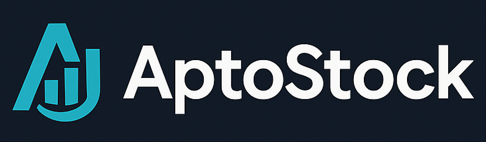

## 项目名称：AptoStock

## LOGO

## 简介

在 Aptos 上发行、交易、做多做空并赚取收益的合成股票资产。

## 项目定位 / 核心使命

- 将真实世界的股票市场敞口带入 Aptos DeFi
- 通过预言机定价，将股票代币化为链上合成资产
- 围绕合成股票提供核心 DeFi 能力：交易、杠杆、衍生品与流动性

## 主要组成 / 功能模块

- **币股合成（Stock Token Minting）**：用户存入稳定币（USDT/USDC）铸造与股票价格锚定的代币
- **杠杆多 / 空（2× leverage long/short）**：使用合成代币开多或开空；平台在 CEX 对冲以管理风险
- **交易（Trading）**：在内置 DEX 交易，或接入 Aptos 生态的其他 DEX 进行买卖
- **流动性提供 + 奖励（LP & Rewards）**：为“股票代币/稳定币”池子提供流动性，赚取交易费、LP 奖励与 staking 收益
- **价格预言机（Oracle）**：聚合传统交易所/数据源价格并链上校验，控制链上价格与真实价格偏差（如 1%）

## 衍生品 / 创新要素

- **永续合约（Perpetuals）与期权（Options）** 围绕合成股票展开
- **稳定币路由优化**：参考 Curve 机制的路由与不变式优化，提升成交效率
- **组合性**：让股票代币可用于抵押、金库与各类收益策略，成为 DeFi 的“活资产”

## 优势 / 差异化

- **Aptos 高性能与低成本**：带来更顺滑的交易与策略执行体验
- **价格锚定**：预言机 + 对冲机制使链上价格紧随真实股票
- **多元收益来源**：交易费、LP 奖励、杠杆利息、staking 收益
- **透明可审计**：关键流程上链，可追踪与审计

## 风险控制与稳定性机制

- **对冲机制**：在 CEX 做对冲，管理杠杆仓位的方向性风险
- **价格偏差监测**：若链上价格与预言机价格偏差超过阈值，触发校正/限制机制
- **安全护栏（规划）**：熔断、保证金检查、清算机器人与保险基金设计

## 使用流程（用户角度）

1. 使用 USDT/USDC 存入并铸造股票代币
2. 可选：开立 2× 多/空杠杆仓位
3. 在内置或外部 DEX 交易股票代币
4. 提供流动性以赚取交易费、LP 奖励与 staking 收益

## Aptos 集成（设计）

- **Move 智能合约**：覆盖铸造、抵押、杠杆记账、清算与奖励分发
- **预言机适配器**：消费稳健价格源，链上验价并设定偏差边界
- **DEX 集成**：对接 Aptos 原生 AMM/聚合器以完成撮合与路由
- **可组合性**：与 Aptos 生态其他协议协同（抵押、金库、结构化产品）

## 项目成员

[Skyhighfeng](https://github.com/skyh24/)
[Chord]()
[Ivy]()
[Archer]()

## 项目 Deck

https://pitch.com/v/aptostock-3r4eux

## 项目源码

https://github.com/stock-labs/AptoStock

## 高层架构（规划）

- 合约：`StockMint`、`CollateralVault`、`PerpEngine`、`OracleAdapter`、`LiquidationManager`、`RewardsDistributor`
- 服务：离线价格馈送、风险引擎与 CEX 对冲执行器、Indexer/API 网关
- 前端：Next.js（App Router）+ TypeScript + TailwindCSS + 钱包适配（Petra、Pontem 等）

## 技术栈（提议）

- 智能合约：Move（Aptos）
- 前端：Next.js + TypeScript + TailwindCSS（shadcn/ui、Radix）
- 后端/服务：Rust/Golang 或 Node.js（风险/对冲/预言机服务）
- 存储/认证/实时：Supabase（用于必要的链下组件）

## 开始使用（进行中）

本仓库作为 Aptos EVERMOVE Hackathon 的一部分，功能逐步落地：

- 合约：即将开源
- 前端应用：即将开源
- 服务与索引：即将开源

组件发布后，本节将提供：

- 环境准备与依赖
- 合约部署步骤（Devnet/Testnet/Mainnet）
- 前端本地开发与生产发布流程
- 服务运行方式（预言机馈送、对冲执行器、清算机器人）

## 项目亮点

- 以合成资产在 Aptos 上获得真实股票敞口
- 预言机锚定 + 对冲风控，提升价格可靠性
- 一体化 DeFi 场景：交易、杠杆、LP 与衍生策略

## 路线图

- MVP：支持基础铸造/交易、预言机价格与 LP 奖励
- v1：支持 2× 多/空、对冲与清算护栏
- v1.5：上线永续与基础期权
- v2：路由优化、结构化产品与跨协议组合

## 贡献

欢迎参与共建。待贡献指南发布后，可先通过 Issue 讨论想法，或提交 PR。

## 许可证

待定

