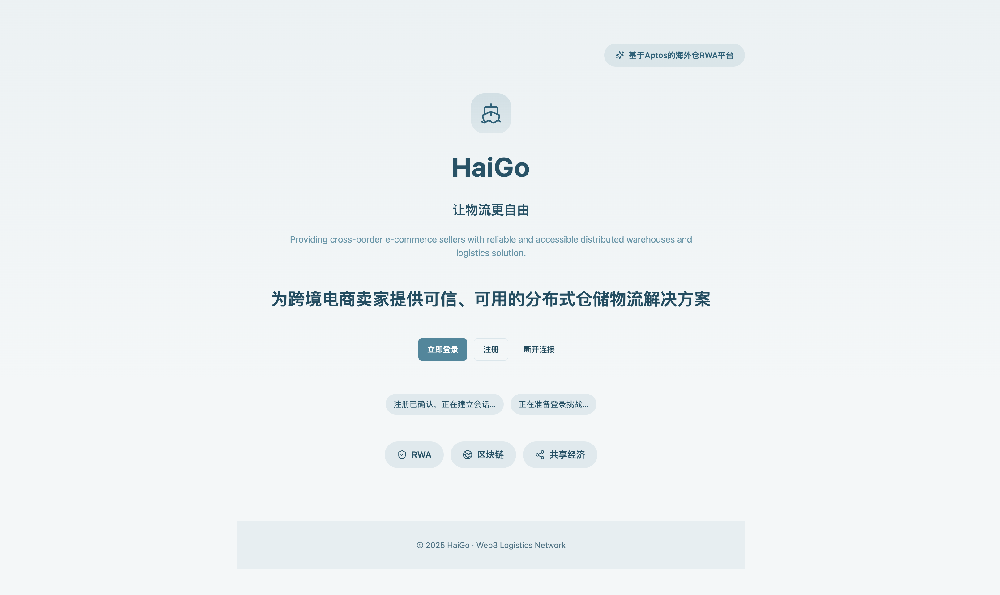
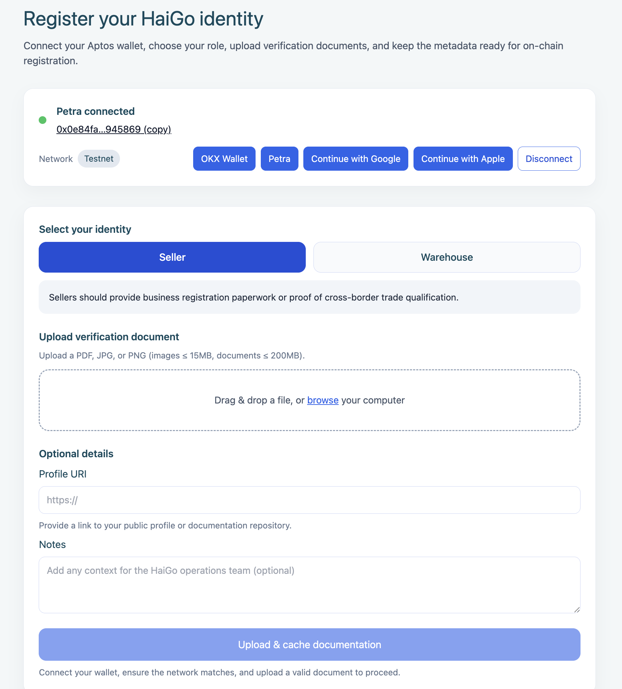
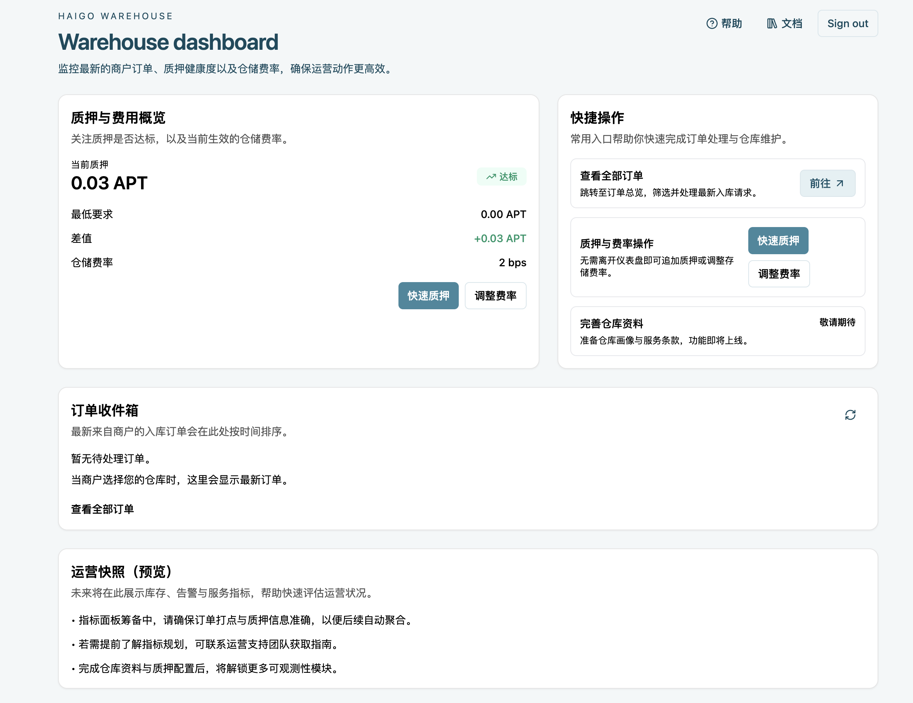
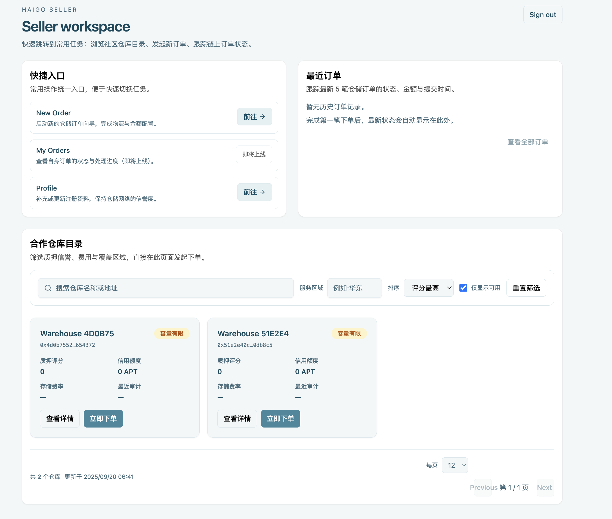

# HaiGo 海行项目介绍

## 项目名称
HaiGo 海行：基于 Aptos 的跨境家庭仓 RWA 网络

## 项目描述
HaiGo 海行聚焦跨境电商在海外仓履约中的信任缺口，围绕“商家—家庭仓—平台”三方协作打造透明的订单生命周期管理。平台在 Aptos 链上记录注册身份、订单状态、质押信用与保险事件，并将体量较大的图像/凭证存储于链下，通过哈希对照保持可信性。商家可以选择可信仓主、创建订单并实时追踪状态；仓主借助质押激励与运营工具提高服务质量；平台方则依托链上数据与 BFF 聚合层提供合规审计与运营分析。

## Aptos 区块链集成
- **Move 模块**：已在测试网交付 `haigo::registry`（角色注册与档案哈希）、`haigo::orders`（订单状态机与事件）、`haigo::staking`（仓主质押与存储费），未来将扩展 `insurance` 与 `reputation` 模块。
- **订单生命周期上链**：`create_order`、`check_in`、`set_in_storage`、`check_out` 等入口函数确保状态机按顺序执行，并产生 `OrderCreated`、`CheckedIn`、`SetInStorage`、`CheckedOut` 事件供链下消费。
- **链下集成**：NestJS BFF 通过 Aptos 官方 Indexer GraphQL 订阅事件，维护游标与补偿机制，并在必要时回落 Fullnode `/v1/view` 读取 Move 视图函数；共享 DTO 发自 `packages/shared`，保持前后端对 Move ABI 的一致理解。
- **部署策略**：PoC 阶段部署在 Aptos Testnet，使用 `pnpm deploy:testnet` 或 `scripts/deploy_aptos_testnet.sh` 生成模块地址，并写回 `.env.local` 供前后端使用。

## 技术栈
- **前端**：Next.js (App Router)、React、TypeScript、@aptos-labs/wallet-adapter-react、shadcn/ui、i18next、Day.js。
- **后端 / BFF**：NestJS、TypeScript (NodeNext ESM)、Prisma、Hasura GraphQL、Aptos Indexer GraphQL、Axios、Prometheus 指标导出。
- **智能合约**：Aptos Move、模块 `registry`, `orders`, `staking`，配套脚本位于 `move/scripts`。
- **数据与基础设施**：Postgres、对象存储（阿里云 OSS/本地磁盘 PoC）、Docker Compose (Hasura + Postgres)、GitHub Actions CI、阿里云 ECS 部署计划。
- **开发工具**：pnpm workspaces、TypeScript、ts-node/esm、Playwright（规划中 E2E）、aptos CLI。

## 项目亮点 / 创新点
- **全链路订单透明化**：链上状态机 + 链下媒体哈希对照，实现订单创建、入库、出库、理赔的可追溯闭环。
- **质押驱动的信用体系**：`haigo::staking` 将质押额度与最低信用守卫绑定，支持仓主费率配置与信用加权。
- **事件驱动的 BFF 聚合**：NestJS 监听 Indexer 事件并写入 Postgres/Hasura，结合 Fullnode 兜底与补偿机制，确保链上状态与链下视图一致。
- **多语言与监管友好 UX**：前端内建 i18n、时区转换，配合运营仪表盘与告警策略满足跨国运营与合规审计。
- **可扩展的 Monorepo 架构**：`move/`、`apps/`、`packages/` 分层，共享 DTO、GraphQL 查询与合约配置，CI 按 workspace 细分流程。

## 未来发展计划（可选）
- **M1 PoC 增强**：补齐理赔流程端到端演示、开启媒体哈希抽检、上线质押信用榜与评分模块。
- **M2 准生产**：迁移对象存储至 OSS、完善监控告警、扩展访问控制与国际化报表、增加 E2E 测试覆盖。
- **后续扩展**：引入 `insurance`/`reputation` Move 模块、强化合规报表导出、评估多云部署与消息队列处理器。

## 团队成员（可选）
Alexis ：https://github.com/blockalexis
大叶： https://github.com/qiaodaye629-tech 
lanyinzly： https://github.com/lanyinzly
三支: https://github.com/sanzhichazi

## 演示视频 / 截图（可选）
- 截图：
  - 
  - 
  - 
  - 
- ppt/包含视频 https://docs.google.com/presentation/d/1HiV6dht88IHgzLladCLDFPlmBUrEZyEZOk7y9xb2aeE/edit?usp=sharing

## 可运行性与功能说明
- 当前 Move 模块已在 Aptos Testnet 部署，配套脚本支持快速初始化测试账户。
- BFF 与前端在本地开发模式可完整跑通注册、订单创建与事件监听流程；媒体验证服务在 PoC 阶段依赖本地磁盘或对象存储。
- 核心功能（注册、订单、质押、时间线）均已具备最小可用实现，后续迭代将继续完善保险与评分模块。

## 仓库
- 仓库： https://github.com/cyl19970726/haigo
- 请在 GitHub README 中链接本文件，并附上演示资源与部署地址。
