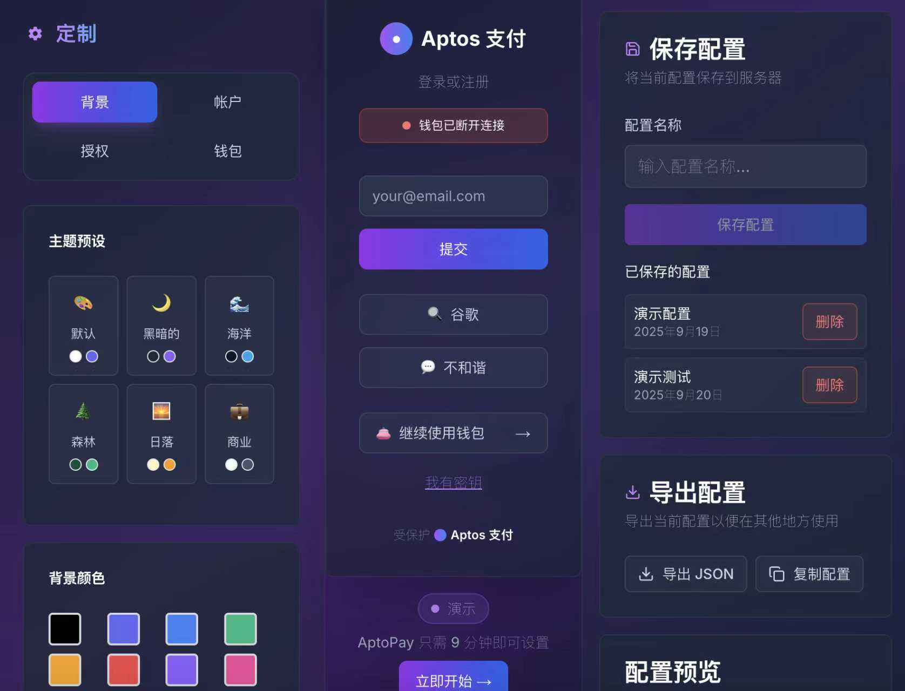
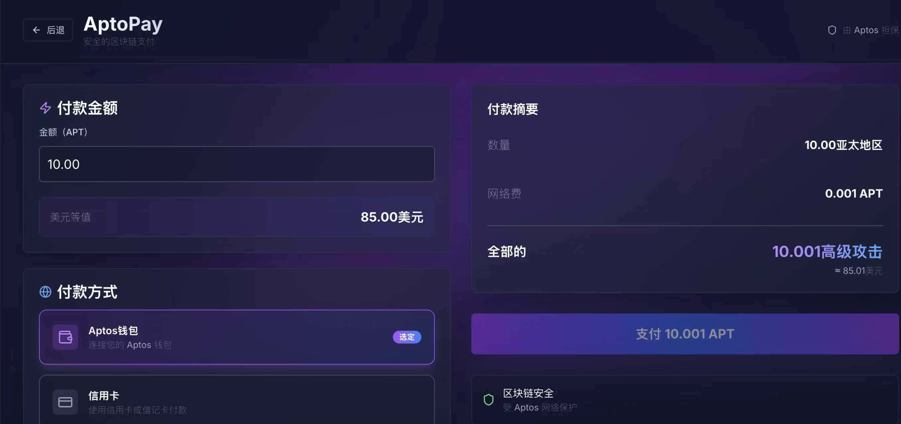
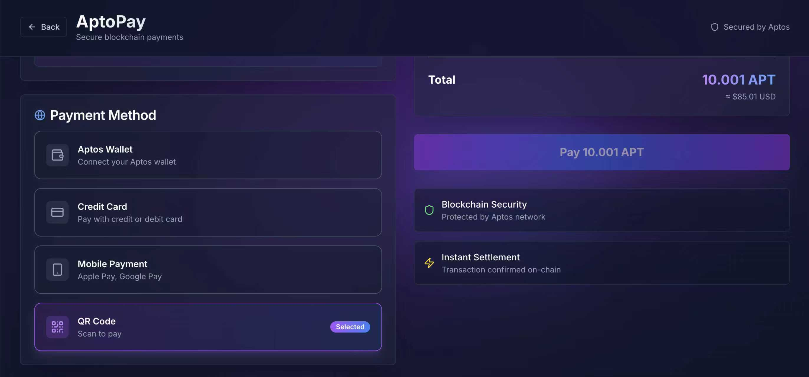

# 项目名称：Meridian Pay(Aptos Pay)

## 项目描述

Meridian Pay 是一个构建于 Aptos 区'块链之上的去中心化、可组合的支付协议工厂。它旨在为 Web3 应用、数字市场和个人用户提供一个安全、灵活且无需许可的支付基础设施。

**我们解决的核心问题：**

1. **交易信任缺失**：通过内置的资金托管（Escrow）功能，解决了点对-点交易中买卖双方的信任问题。
2. **支付体验割裂**：无缝集成了 DEX 协议，允许用户使用其持有的任何代币进行支付，而商家能自动收到他们期望的代币，消除了手动兑换的繁琐步骤。
3. **DApp 开发门槛高**：通过创新的“协议工厂”模式，允许任何 DApp 或社区一键部署自己独立的支付协议实例，而无需从零开始编写和审计复杂的支付合约。

**主要功能：**

* **协议工厂**：任何人都可以部署自己独立的、拥有专属地址和账本的支付协议实例。
* **安全托管支付**：支持买家付款后资金由协议安全托管，交易完成后由双方确认释放或退款。
* **即时直接支付**：提供简单的点对点即时支付功能，适用于高信任度场景。
* **内置自动兑换**：在支付流程中自动为用户完成代币兑换，提升支付体验。

## Aptos 区块链集成

Meridian Pay 深度利用了 Aptos 区块链及其 Move 语言的独特优势，构建了一个安全、高效且符合 Aptos 设计哲学的应用。

1. **核心智能合约 (`meridian-pay`)**：

      * 项目的所有核心逻辑均通过 **Move 语言** 编写，利用其强类型系统和资源所有权模型，从根本上保证了资产的安全性和交易的原子性。
      * 合约代码位于 `sources/MeridianPay.move`。

2. **关键特性利用**：

      * **Aptos 对象模型 (AIP-25)**：我们的“协议工厂”正是基于 Aptos 的对象模型实现的。`create_protocol` 函数会创建一个**具名对象 (Named Object)**，每个对象就是一个独立的协议实例。状态（如订单数据）作为资源存储在对象内，实现了真正的多租户和去中心化。
      * **资源 (Resource)**：`Orders` 结构体是一个资源，安全地存储在每个协议对象的地址下，确保订单数据不能被复制或意外销毁。
      * **Fungible Asset 标准 (AIP-21)**：合约完全遵循官方的 Fungible Asset 标准来处理所有代币的转移、托管和接收，保证了与生态系统中所有标准代币的兼容性。
      * **Table**: 在 `Orders` 资源内部，我们使用 `Table` 结构来高效地存储和管理海量的订单数据，保证了合约的可扩展性。
      * **事件 (Events)**：合约在关键操作（如创建订单、释放资金）后会触发链上事件 (`OrderCreated`, `OrderReleased`)，便于前端应用和链下索引器进行监听和响应。

3. **前端交互**：

      * 我们的前端演示应用通过 **Aptos TypeScript SDK** 与 Aptos 链进行交互。
      * 通过调用 `aptos.view` 来读取链上数据（如 `get_order` 视图函数），并通过 `signAndSubmitTransaction` 将用户签名的交易提交上链，以执行 `pay_and_escrow` 等入口函数。

## 技术栈

* **智能合约 (后端)**

  * **语言**: Move on Aptos
  * **框架/库**: Aptos Framework (Object, Fungible Asset, Table, Event)
  * **依赖**: `dex_contract::pool_v3` (用于实现代币兑换逻辑)

* **前端 & 工具**

  * **框架**: Next.js
  * **钱包集成**: AptoPay 钱包适配器平台 (`@aptos-labs/wallet-adapter-react`)
  * **区块链交互**: Aptos TypeScript SDK (`@aptos-labs/ts-sdk`)
  * **UI 库**: Material-UI (MUI) / Ant Design (由 AptoPay 提供支持)
  * **构建系统**: pnpm, TurboRepo

## 安装与运行指南

评委可以通过以下步骤在本地环境中完整地部署和体验我们的项目。

**前提条件：**

* 安装 [Node.js](https://nodejs.org/) (v18 或更高版本)
* 安装 [pnpm](https://pnpm.io/installation)
* 安装 [Aptos CLI](https://www.google.com/search?q=https://aptos.dev/cli-tools/aptos-cli/install-aptos-cli) 并创建一个本地测试钱包 (`aptos init`)

-----

### **第一部分：部署智能合约**

1. **克隆合约仓库并部署**

    ```bash
    git clone https://github.com/qiaopengjun5162/meridian-pay.git
    cd meridian-pay

    # 编译合约
    aptos move compile

    # 发布合约 (请确保你的钱包有足够的测试币)
    aptos move publish --named-addresses meridianpay_core=YOUR_WALLET_ADDRESS
    ```

    ⚠️ **重要提示**：请务必记下发布后输出的**合约地址**，前端将需要它。

2. **创建您的协议实例**
    合约部署后，您需要创建第一个支付协议实例。

    ```bash
    # 调用 create_protocol 函数
    aptos move run --function-id 'YOUR_CONTRACT_ADDRESS::MeridianPay::create_protocol'
    ```

    此交易成功后，您的第一个协议实例就创建好了。其实例地址可以通过 `MeridianPay::get_protocol_address` 视图函数查询，通常是您的钱包地址派生出的对象地址。

-----

### **第二部分：运行前端演示应用**

1. **克隆前端项目 (AptoPay Fork)**
    *我们基于 AptoPay 框架构建了演示应用。请克隆我们的前端 Fork。*

    ```bash
    # 替换成您的 AptoPay Fork 地址
    git clone https://github.com/YOUR_USERNAME/AptoPay-0919.git
    cd AptoPay-0919
    ```

2. **安装依赖**

    ```bash
    pnpm install
    ```

3. **配置环境变量**
    在 `apps/meridian-pay-demo/` (或您修改的前端示例) 目录下，创建一个 `.env.local` 文件，并填入您的合约信息：

    ```
    # .env.local
    NEXT_PUBLIC_CONTRACT_ADDRESS="合约部署地址"
    NEXT_PUBLIC_PROTOCOL_ADDRESS="协议实例的对象地址"
    ```

4. **启动前端应用**

    ```bash
    # 确保你在 AptoPay-0919 的根目录
    pnpm dev --filter=meridian-pay-demo # 假设您的应用叫 meridian-pay-demo
    ```

    现在，您可以在浏览器中打开 `http://localhost:3000` 来体验完整的功能。

## 项目亮点/创新点

1. **基于对象模型的协议工厂**
    我们没有构建一个单一、中心化的托管合约，而是利用 Aptos 最新的对象模型，创建了一个无需许可的“工厂”。这使得我们的协议具有极强的可扩展性和去中心化特性，任何项目方都可以拥有自己独立的支付实例，实现了真正的“协议即服务”。

2. **无缝的链上兑换体验 (UX)**
    我们将 DEX 兑换功能深度集成到支付流程中，是 Aptos 生态中为数不多的能提供“用 A 币支付，B 币到账”丝滑体验的应用。这极大地降低了用户的操作门槛，是 Web3 应用走向主流的关键一步。

3. **可组合的支付原语 (Composable Primitive)**
    我们将 Meridian Pay 定位为一个底层的“支付原语”，而不是一个封闭的应用。它的标准化接口可以被任何其他 DApp（如 NFT 市场、游戏、DAO 工具）像乐高积木一样轻松集成，赋能整个 Aptos 生态。

4. **全栈解决方案展示**
    本次黑客松我们不仅提交了一个安全可靠的智能合约，还结合 AptoPay 钱包适配器平台，提供了一个功能完整、体验优秀的前端演示，展示了一个从合约到用户界面的完整 DApp 解决方案。

## 未来发展计划

* **内置争议仲裁机制**：引入去中心化的仲裁节点或与 Kleros 等协议集成，为托管交易提供更完善的争议解决方案。
* **支持订阅和周期性支付**：扩展合约功能，以支持订阅付费、分期付款等更复杂的商业场景。
* **集成 DEX 聚合器**：接入 DEX 聚合器以获得更优的兑换价格和更广的代币支持。
* **开发者 SDK**: 发布专门的 JavaScript/TypeScript SDK，让其他开发者能用更少的代码、更方便地集成 Meridian Pay 协议。

## 项目截图







参考

* <https://github.com/qiaopengjun5162/meridian-pay>
