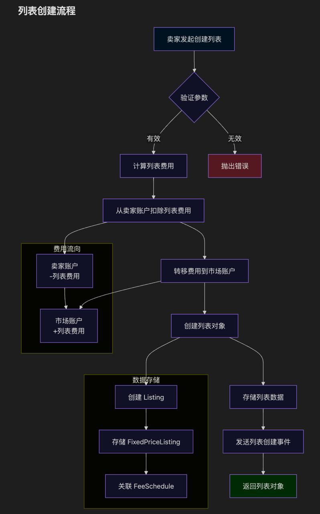
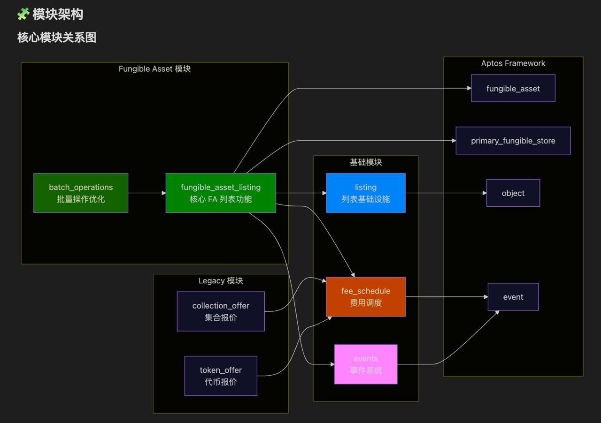

# 项目介绍｜RWA 线下抽卡 × Web3 链上抽卡（Aptos）

## github

https://github.com/awaqawaqawaq/mofumofuGacha

## 概述

我们打造一套贯通线下与链上的卡牌消费与收藏体验：

- 在线下部署实体抽卡机，提供“实体抽卡 + 数字凭证”的即时体验。
- 在线上提供像素风卡牌的开包、展示、交易（Marketplace）与上架功能。
- 通过 Aptos 网络完成资产确权与交易签名，保证用户资产的可验证性与可转移性。

核心诉求：把“拆盲盒/抽卡”的快乐，通过 RWA（实物卡）与 Web3（链上资产）双轨融合，沉淀长期的数字藏品生态与玩家社群。

## 用户旅程

1) 线下抽卡（RWA）
   
   - 玩家在实体卡机前选择卡包档位（Standard/Pro/Legendary）。
   - 支付后机器吐出实体卡，并在屏上展示一枚动态二维码/短码。
   - 玩家用手机扫码，跳转到线上 DApp，完成钱包连接并“认领”与实体卡绑定的链上藏品/道具。

2) 线上抽卡（Web3）
   
   - 玩家在 DApp 内购买卡包（Standard/Pro/Legendary），完成签名后进入像素风开包动画，获得随机卡牌。
   - 获得的卡牌可在 Marketplace 中挂牌、购买、浏览与筛选。

3) 双向打通
   
   - 线下实体卡上的防伪编码具有一次性兑换属性，可将实物权益与链上藏品一一对应。
   - 线上抽到的“道具卡”可在指定线下门店或活动中兑换周边、权益或赛事参赛资格。

## 核心功能

- 卡包开盒：Standard/Pro/Legendary 多档概率权重、逐张揭示的动画反馈。
- 市场交易：
  - 列表页：搜索、分类（标准/进阶/传奇/其他）、价格区间、排序。
  - 详情卡片：价格、卖家、图片/像素展示，支持一键购买。
  - 上架：填写名称、描述、分类、价格与图片后即可发布。
- 钱包连接：基于 Aptos Wallet Standard，兼容主流钱包，交易通过消息签名完成。
- 资产凭证：线下卡机与线上 DApp 使用同一套资产标识规范，确保归属与防伪。

## 技术架构（简述）

- 前端（本仓库）：
  - React + Vite，像素风交互与动画（卡包翻转、逐张揭示）。
  - Aptos 钱包适配器（@aptos-labs/wallet-adapter-react / ts-sdk）。
  - Marketplace：本地列表 + 过滤器 + 购买/上架流程的交互视图。
- 区块链（Aptos）：
  - 账户签名与交易提交（购买与上架）。
  - 藏品/卡牌元数据：稀有度、图像、系列归属以及可扩展的道具属性。
- 线下卡机：
  - 支付模块（现金/刷卡/本地支付聚合）。
  - 打码模块：为每张实体卡写入一次性凭证（二维码/NFC/序列号）。
  - 联网同步：将发卡记录同步至服务端以备核验；亦支持离线缓存后补传。
- 服务端（可选）：
  - 防伪与兑换：校验线下凭证未被使用，并为链上账户签发可兑换的数字资产。
  - 统计与风控：设备心跳、库存、失败重试、黑名单库、设备固件 OTA。

## 线下卡机（RWA）设计要点

- 防伪编码：每张卡包含一个一次性兑换凭证，具备防复用与防伪造能力（签名/动态盐/时间窗）。
- 设备管理：支持设备序列号、状态上报、料盒余量、补货提示、异常报警。
- 体验优化：大屏动画与音效；扫码即跳转；现场也可直接连接钱包进行链上领取。

## 链上合约（方向）

- 卡牌资产：
  - 标准：基于 Aptos 的可转让藏品标准（支持批量铸造与元数据扩展）。
  - 稀有度：结合抽卡概率与系列编号，明确稀有度与总量上限。
- 市场交易：
  - 授权与委托：上架/成交使用安全校验的签名流程，兼顾体验与安全。
  - 版税与手续费：支持创作者分成与平台抽成，透明可审计。
- 凭证兑换：
  - 线下邀请码/兑换码在链上换取铸造/认领权限（一次性）
  - 支持时间窗、白名单/灰名单与限流策略。

## Marketplace 经济与激励

- 卡包收益：不同档位价格与稀有度配置，兼顾可玩性与稀缺性。
- 二级市场：
  - 版税：鼓励艺术家与系列方持续创作。
  - 活动：周榜/月榜交易激励、收藏家勋章、空投活动。
- 线下联动：凭线上藏品可参与线下活动、赛事与兑换权益，形成循环。

## 安全与风控

- 钱包安全：仅在必要时发起签名请求；签名明文明确操作与资产。
- 凭证风控：一次性兑换码、签名校验、重放保护、设备/门店维度限流。
- 数据一致性：线下与线上采用同一资产 ID 空间与哈希规则，避免对账分歧。

## 商业模式

- 线下设备租售/分成：按设备/门店抽成或 SaaS 服务费。
- 卡包售卖：主题联名、季节款、限定系列、赛事特别版。
- 二级市场分成：撮合成交抽取平台费与创作者版税。
- B 端解决方案：为线下乐园/电竞馆/咖啡店提供联名主题与活动运营。

## 里程碑

- M1：线下卡机原型 + DApp MVP + 基础 Marketplace。
- M2：与门店联运试点，打通兑换闭环与活动玩法。
- M3：合约审计与规模化部署，拓展联名系列与城市网络。

## 合约架构

